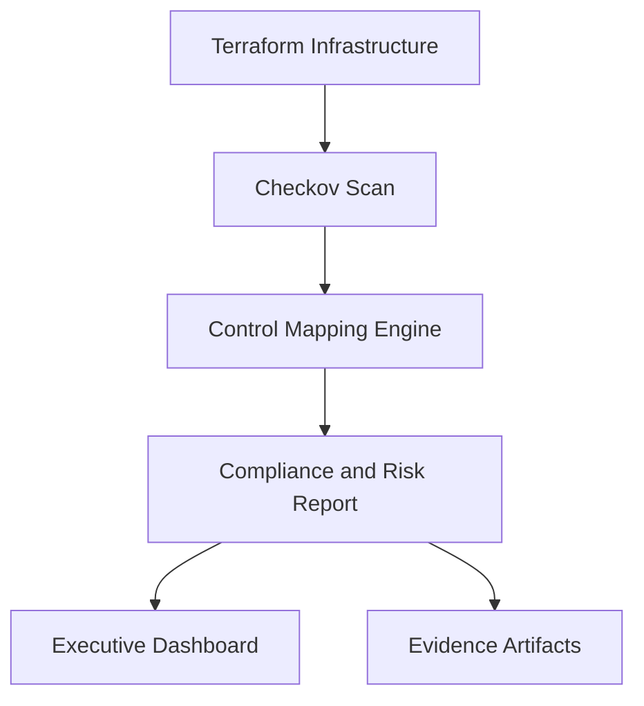

<p align="center">
  
</p>

<p align="center">
  <b>Calm Resilience Security LTD</b><br>
  <i>Engineering calm through resilient security</i>
</p>

# GRC as Code Lab

A production-style GRC-as-Code platform prototype that turns cloud misconfigurations into control failures, framework impacts, compliance posture, risk scores, and release decisions.

This repository demonstrates how regulated organisations can move from manual audits to continuous assurance using infrastructure scanning, control mapping, risk scoring, evidence generation, and a published executive dashboard.

## Current Release

**Latest release:** `v1.1-expanded-controls`

## Live Dashboard

[Executive Governance Dashboard](https://jaymeso.github.io/grc-as-code-lab/)

## What the Platform Does

The platform evaluates infrastructure findings against governance controls and produces:

- control-level pass/fail results
- framework summaries across ISO 27001, SOC 2, and NIST
- compliance scoring
- aggregated risk scoring
- deployment decisions
- machine-readable evidence files
- a published executive dashboard through GitHub Pages

## Current Improvements Reflected in This Version

This release expands the original baseline implementation into a broader enterprise governance prototype.

- Added cloud governance controls
- Added network security controls
- Added resilience and recovery controls
- Added secure engineering controls
- Hardened the GRC engine to support mixed control formats
- Added deduplication for repeated control IDs across control files
- Regenerated the evidence report and live dashboard output

## Governance Coverage

The current control library spans eight governance domains:

- Storage Security
- Identity and Access Management
- Data Protection
- Logging and Monitoring
- Cloud Governance
- Network Security
- Resilience and Recovery
- Secure Engineering

The current repository evaluates nine unique controls across these domains.

## Sample Output

The latest generated governance outcome is:

```text
Compliance Score: 44.44%
Risk Level: HIGH
Decision: BLOCK DEPLOYMENT
```

Detailed output is published in:

- [evidence/week3_risk_report.txt](evidence/week3_risk_report.txt)
- [site/index.html](site/index.html)

## Example Controls

Representative controls in the current library include:

- `GRC-001` Public S3 Buckets Prohibited
- `GRC-002` S3 Versioning Required
- `GRC-101` No Wildcard IAM Policies
- `GRC-201` S3 Buckets Must Use KMS Encryption
- `GRC-301` S3 Buckets Must Have Access Logging Enabled
- `GRC-401` Approved Cloud Services Must Be Governed
- `GRC-501` S3 Buckets Must Support Recovery
- `GRC-601` Public Network Exposure Must Be Restricted
- `GRC-701` Secure Development Requirements Must Be Defined

## How It Works



At a high level:

1. Terraform examples represent secure and insecure cloud configurations.
2. Checkov produces JSON findings for the infrastructure under test.
3. The Python engine loads all YAML control files, resolves control mappings, and evaluates pass/fail status.
4. Results are translated into framework summaries, compliance score, risk level, and deployment decision.
5. A dashboard is generated and published through GitHub Pages.

## Current Engine Behavior

The latest engine implementation in [grc_engine.py](grc_engine.py):

- loads all control YAML files under `controls/`
- supports both direct `checkov` mappings and older OPA-backed baseline controls
- deduplicates repeated control IDs across overlapping control files
- defaults missing severity safely
- writes evidence output to `evidence/week3_risk_report.txt`
- exits with status code `1` when the decision is `BLOCK DEPLOYMENT`

## CI/CD and Publishing

The GitHub Actions workflow in [.github/workflows/compliance.yml](.github/workflows/compliance.yml):

- runs on pushes to `main`
- runs on pull requests targeting `main`
- installs Python dependencies
- executes Checkov against the Terraform examples
- runs the compliance and risk engine
- generates the dashboard
- uploads evidence artifacts
- deploys the `site/` folder to GitHub Pages

This means the published dashboard reflects the latest successful workflow run on `main`.

## Repository Structure

```text
grc-as-code-lab/
├── assets/                     Branding assets
├── controls/                   YAML control definitions
├── diagrams/                   Architecture notes
├── docs/                       Training documentation
├── evidence/                   Generated governance evidence
├── policies/                   OPA policy rules
├── site/                       GitHub Pages output
├── terraform/                  Secure and insecure IaC examples
├── generate_dashboard.py       Dashboard generator
├── grc_engine.py               Compliance and risk engine
├── requirements.txt            Python dependencies
└── README.md
```

## Local Usage

Install dependencies:

```bash
pip install -r requirements.txt
```

Generate Checkov results:

```bash
checkov -d terraform --output json > checkov_results.json || true
```

Run the governance engine:

```bash
python3 grc_engine.py
```

Generate the dashboard:

```bash
python3 generate_dashboard.py
```

## Evidence Trail

The `evidence/` folder captures the platform progression:

- Week 1 - Foundations of GRC as Code
- Week 2 - Compliance Evaluation Report
- Week 3 - Risk Engine Evidence
- Week 4 - Enterprise Governance Evidence
- Week 5 - Executive summary and client-ready positioning

## Training Material

A full instructor guide for running the lab in a training environment is available at [docs/grc-as-code-training-manual.md](docs/grc-as-code-training-manual.md).

## Who This Is For

This prototype is relevant to:

- fintech platforms
- cloud-native regulated businesses
- security and GRC leaders
- DevSecOps teams
- organisations aligning to ISO 27001, SOC 2, and NIST

## Commercial Context

This project is released under the MIT License and can be used, modified, and extended.

It also serves as a reference implementation of a GRC-as-Code architecture developed by **Calm Resilience Security LTD** for:

- cloud governance automation
- GRC engineering and control design
- ISO 27001 / SOC 2 / NIST-aligned assurance workflows
- risk-based deployment decisioning
- CI/CD-integrated compliance evidence generation

Contact: `enquiries@calmresilience.security`

## Disclaimer

This project is provided for educational and demonstration purposes. It does not constitute legal, regulatory, or compliance advice.
