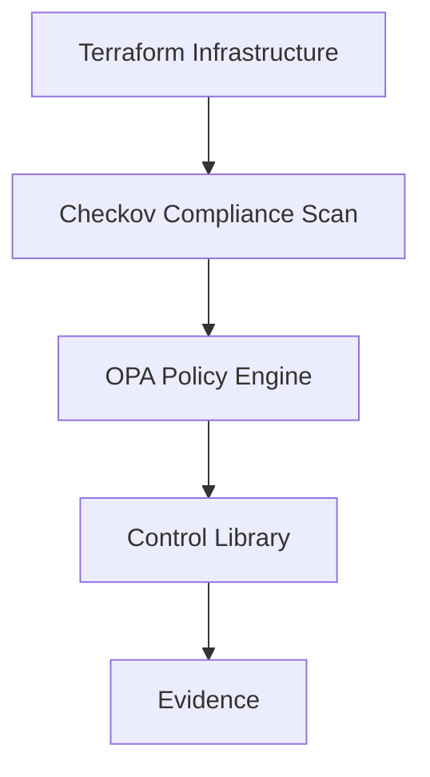

  

  <b>Calm Resilience Security LTD</b> 
  <i>Engineering calm through resilient security</i>

# GRC as Code Lab

## What This Is

A production-style GRC-as-Code platform prototype that converts cloud misconfigurations into control failures, framework impacts, risk scores, and deployment decisions.

Built to demonstrate how modern organisations can move from manual audits to continuous assurance.

## Enterprise Control Coverage

This platform currently evaluates multiple governance domains:

- Storage Security
- Identity & Access Management
- Data Protection
- Logging & Monitoring

It produces a unified compliance score, risk score, and deployment decision across all control families.

## Overview

This repository demonstrates how **Governance, Risk, and Compliance (GRC)** controls can be implemented as code using modern cloud security tools.

The project shows how traditional governance controls can be translated into **machine-enforced policies** enabling continuous compliance.

### Course Roadmap
This repository is structured as a progressive GRC engineering training programme.

### Week 1 – Foundations: GRC as Code

- Infrastructure as Code (Terraform)
- Policy as Code (OPA)
- Compliance Scanning (Checkov)
- Control Definition (YAML)
- Evidence capture

Outcome:
- Detect misconfigurations
- Understand control enforcement

---

### Week 2 – Compliance Engine & Automation

- Checkov JSON parsing
- Control mapping engine (Python)
- Framework mapping (ISO27001 / SOC2 / NIST)
- Compliance scoring
- GitHub Actions integration
- Automated evidence generation

Outcome:
- Translate technical findings into compliance posture
- Generate audit-ready evidence automatically

---

### Week 3 – Risk Engine

- Risk weighting per control
- Total risk score calculation
- Risk classification (LOW / MEDIUM / HIGH)
- Deployment decision logic

Outcome:
- Move from compliance reporting to risk-based governance

---

### Week 4 – Enterprise GRC Architecture

- Expanded from single-family controls to multi-family governance
- Added IAM control family
- Added Data Protection control family
- Added Logging & Monitoring control family
- Unified enterprise risk scoring across multiple domains

Outcome:
- Aggregate risk across storage, identity, data protection, and logging
- Produce a single governance decision across multiple control families

---

### Week 5 – Client-Ready Fintech Use Case

- Fintech governance scenario
- Executive-style reporting
- Product-style repo positioning
- Business-value framing

Outcome:
- Turn the lab into a client-ready governance product prototype

## Evidence Trail

The `evidence/` folder captures the progression of the platform:

- Week 1 – Foundations of GRC as Code
- Week 2 – Compliance Evaluation Report
- Week 3 – Risk Engine Evidence
- Week 4 – Enterprise Governance Evidence

## Example Outcomes

This lab demonstrates multiple governance states depending on infrastructure configuration.

### Scenario A – Medium Risk

- GRC-001 Public S3 Buckets Prohibited: PASS  
- GRC-002 S3 Versioning Required: FAIL  
- Compliance Score: 50.00%  
- Risk Level: MEDIUM  
- Decision: REVIEW REQUIRED  

This scenario reflects a partially compliant environment where issues exist but do not require immediate deployment blocking.

---

### Scenario B – High Risk

- GRC-001 Public S3 Buckets Prohibited: FAIL  
- GRC-002 S3 Versioning Required: FAIL  
- Compliance Score: 0.00%  
- Risk Level: HIGH  
- Decision: BLOCK DEPLOYMENT  

This scenario demonstrates a critical misconfiguration where deployment must be stopped.

---

### Why This Matters

Modern GRC systems should not operate on binary pass/fail logic.

This lab demonstrates:

- Partial compliance handling  
- Risk-based decision making  
- Automated enforcement of governance thresholds  

This repository is structured as a progressive GRC engineering training programme.

### Week 1 – Foundations: GRC as Code

- Infrastructure as Code (Terraform)
- Policy as Code (OPA)
- Compliance Scanning (Checkov)
- Control Definition (YAML)
- Evidence capture

Outcome:
- Detect misconfigurations
- Understand control enforcement

---

### Week 2 – Compliance Engine & Automation

- Checkov JSON parsing
- Control mapping engine (Python)
- Framework mapping (ISO27001 / SOC2 / NIST)
- Compliance scoring
- GitHub Actions integration
- Automated evidence generation

Outcome:
- Translate technical findings into compliance posture
- Generate audit-ready evidence automatically

---

### Week 3 – Risk Engine (Coming Next)

- Risk scoring (HIGH / MEDIUM weighting)
- Control criticality
- Compliance thresholds
- Risk-based decision making
- Dashboard-style output

Outcome:
- Move from compliance → risk intelligence

---

### Week 4 – Enterprise GRC Architecture

- Expanded from single-family controls to multi-family governance
- Added IAM control family
- Added Data Protection control family
- Unified enterprise risk scoring across multiple domains

Control families now include:
- Storage Security
- Identity & Access Management
- Data Protection

Example outcome:
- Compliance Score: 25.00%
- Risk Level: HIGH
- Decision: BLOCK DEPLOYMENT

---

- Added Logging / Monitoring control family

Control families now include:
- Storage Security
- Identity & Access Management
- Data Protection
- Logging / Monitoring

---

## What This Project Demonstrates

This lab simulates how modern cloud governance platforms operate:

- Continuous compliance (every commit is evaluated)
- Control abstraction (technical → governance)
- Framework alignment (ISO27001, SOC2, NIST)
- Automated evidence generation
- DevSecOps integration

The system evolves from:
Misconfiguration detection

to:

Compliance as Code

and ultimately to:

Risk-based governance

## Tools Used

- Terraform (Infrastructure as Code)
- Open Policy Agent (Policy Engine)
- Checkov (Compliance Scanner)

## Architecture

This diagram illustrates how governance controls are enforced through automated scanning and policy evaluation.

## Repository Structure

grc-as-code-lab
│
├ terraform/ Infrastructure examples
├ policies/ Governance policy rules
├ controls/ Control definitions
├ evidence/ Audit evidence
├ diagrams/ Architecture diagrams
├ docs/ Training documentation
└ README.md

## Example Controls

This lab demonstrates several governance controls including:

- Public S3 buckets prohibited
- S3 versioning required
- Secure storage configuration

## Evidence Trail

The `evidence/` folder captures the progression of the platform:

- Week 1 – Foundations of GRC as Code
- Week 2 – Compliance Evaluation Report
- Week 3 – Risk Engine Evidence
- Week 4 – Enterprise Governance Evidence

## Training Manual

A full instructor guide for running this lab in a training environment is available here: docs/grc-as-code-training-manual.md

## About

This training lab is developed and maintained by **Calm Resilience Security LTD**, a consultancy focused on:

- Cloud governance and security
- GRC automation
- ISO27001 / SOC2 alignment
- DevSecOps integration

The goal is to demonstrate how modern organisations can move from manual compliance processes to **automated, continuous assurance**.

---

## Commercial Use & Services

This project is released under the MIT License and is free to use, modify, and distribute.

However, this repository represents a **reference implementation of a GRC-as-Code architecture** developed by **Calm Resilience Security LTD**.

For organisations looking to:

- Implement enterprise-grade GRC automation
- Integrate compliance into CI/CD pipelines
- Build ISO 27001 / SOC 2 / NIST-aligned control frameworks
- Operationalise risk-based deployment decisions

We offer consulting, advisory, and implementation services.

📩 Contact: enquiries@calmresilience.security  
🌐 Company: Calm Resilience Security LTD

---

## Disclaimer

This project is provided for educational and demonstration purposes.  
It does not constitute legal, regulatory, or compliance advice.
