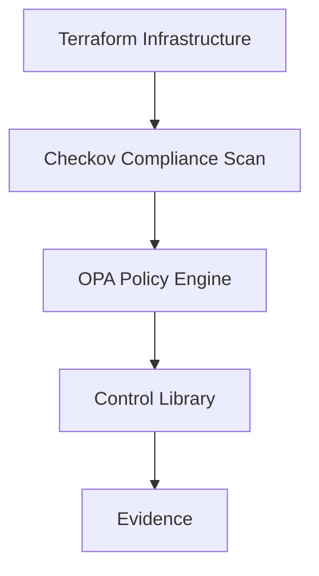

# GRC as Code Lab

## Overview

This repository demonstrates how **Governance, Risk, and Compliance (GRC)** controls can be implemented as code using modern cloud security tools.

The project shows how traditional governance controls can be translated into **machine-enforced policies** enabling continuous compliance.

## Tools Used

- Terraform (Infrastructure as Code)
- Open Policy Agent (Policy Engine)
- Checkov (Compliance Scanner)

## Architecture

This diagram illustrates how governance controls are enforced through automated scanning and policy evaluation.

## Repository Structure

grc-as-code-lab
│
├ terraform/ Infrastructure examples
├ policies/ Governance policy rules
├ controls/ Control definitions
├ evidence/ Audit evidence
├ diagrams/ Architecture diagrams
├ docs/ Training documentation
└ README.md

## Example Controls

This lab demonstrates several governance controls including:

- Public S3 buckets prohibited
- S3 versioning required
- Secure storage configuration

## Training Manual

A full instructor guide for running this lab in a training environment is available here: docs/grc-as-code-training-manual.md

## Purpose

The purpose of this repository is to demonstrate how organizations can implement **continuous compliance** using Infrastructure as Code, policy engines, and automated security scanning.

## Future Improvements

Planned enhancements include:

- CI/CD compliance pipelines
- Automated control evaluation
- Risk scoring engine
- Framework mapping (ISO27001, SOC2, NIST)

