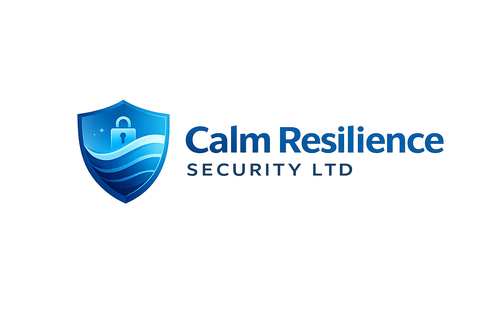
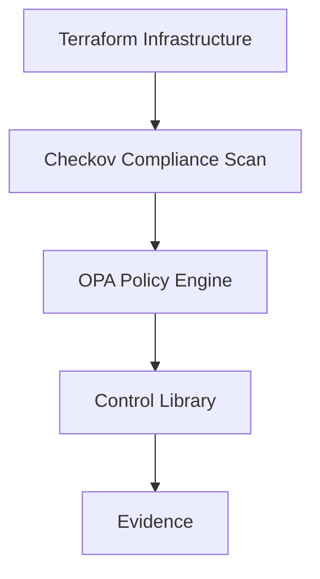

  

  <b>Calm Resilience Security LTD</b> 
  <i>Engineering calm through resilient security</i>

# GRC as Code Lab

A hands-on training environment demonstrating how governance, risk, and compliance (GRC) can be implemented as code using modern cloud security tooling.

## Overview

This repository demonstrates how **Governance, Risk, and Compliance (GRC)** controls can be implemented as code using modern cloud security tools.

The project shows how traditional governance controls can be translated into **machine-enforced policies** enabling continuous compliance.

## Course Roadmap

This repository is structured as a progressive GRC engineering training programme.

### Week 1 – Foundations: GRC as Code

- Infrastructure as Code (Terraform)
- Policy as Code (OPA)
- Compliance Scanning (Checkov)
- Control Definition (YAML)
- Evidence capture

Outcome:
- Detect misconfigurations
- Understand control enforcement

---

### Week 2 – Compliance Engine & Automation

- Checkov JSON parsing
- Control mapping engine (Python)
- Framework mapping (ISO27001 / SOC2 / NIST)
- Compliance scoring
- GitHub Actions integration
- Automated evidence generation

Outcome:
- Translate technical findings into compliance posture
- Generate audit-ready evidence automatically

---

### Week 3 – Risk Engine (Coming Next)

- Risk scoring (HIGH / MEDIUM weighting)
- Control criticality
- Compliance thresholds
- Risk-based decision making
- Dashboard-style output

Outcome:
- Move from compliance → risk intelligence

## What This Project Demonstrates

This lab simulates how modern cloud governance platforms operate:

- Continuous compliance (every commit is evaluated)
- Control abstraction (technical → governance)
- Framework alignment (ISO27001, SOC2, NIST)
- Automated evidence generation
- DevSecOps integration

The system evolves from:
Misconfiguration detection

to:

Compliance as Code

and ultimately to:

Risk-based governance

## Tools Used

- Terraform (Infrastructure as Code)
- Open Policy Agent (Policy Engine)
- Checkov (Compliance Scanner)

## Architecture

This diagram illustrates how governance controls are enforced through automated scanning and policy evaluation.

## Repository Structure

grc-as-code-lab
│
├ terraform/ Infrastructure examples
├ policies/ Governance policy rules
├ controls/ Control definitions
├ evidence/ Audit evidence
├ diagrams/ Architecture diagrams
├ docs/ Training documentation
└ README.md

## Example Controls

This lab demonstrates several governance controls including:

- Public S3 buckets prohibited
- S3 versioning required
- Secure storage configuration

## Training Manual

A full instructor guide for running this lab in a training environment is available here: docs/grc-as-code-training-manual.md

## Purpose

The purpose of this repository is to demonstrate how organizations can implement **continuous compliance** using Infrastructure as Code, policy engines, and automated security scanning.

## Future Improvements

Planned enhancements include:

- CI/CD compliance pipelines
- Automated control evaluation
- Risk scoring engine
- Framework mapping (ISO27001, SOC2, NIST)

## Run the Lab

Clone the repository:
git clone https://github.com/Jaymeso/grc-as-code-lab.git

cd grc-as-code-lab

Install dependencies:
brew install terraform
brew install open-policy-agent
pip3 install checkov pyyaml

Run compliance scan:
checkov -d terraform

Run compliance engine:
checkov -d terraform --output json > checkov_results.json
python3 evaluate_controls.py

## About

This training lab is developed and maintained by **Calm Resilience Security LTD**, a consultancy focused on:

- Cloud governance and security
- GRC automation
- ISO27001 / SOC2 alignment
- DevSecOps integration

The goal is to demonstrate how modern organisations can move from manual compliance processes to **automated, continuous assurance**.
